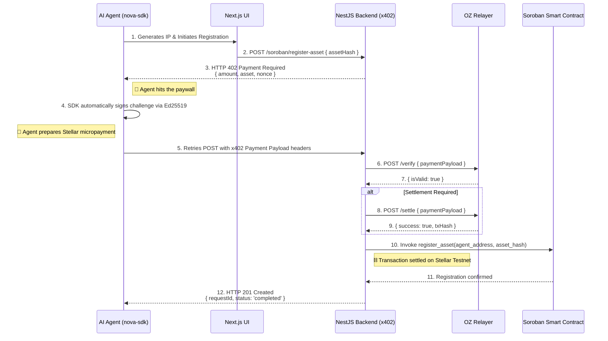

<div align="center">


# ✦ Nova Registry

### *The first autonomous AI agent ecosystem for M2M payments on Stellar*

<p>
  
  
  
  
  
  
  
</p>

<p>
  <b>Protect your AI-generated music IP with the x402 protocol and Soroban smart contracts.</b><br/>
  Agents that don't just reason — they pay, negotiate, and settle on-chain.
</p>

</div>

---

## 🎥 Demo Video

<div align="center">

[](https://www.youtube.com/watch?v=ZCoyns4OA-I)

*Click the thumbnail to watch the full walkthrough*

</div>

---

## ⚡ Live Facilitator Endpoint

> The Nova Registry backend is live and publicly accessible. This is the **x402 payment facilitator** — the server your SDK must point to for autonomous asset registration on Stellar.

<div align="center">

### 🌐 [`https://dot-revealable-telescopically.ngrok-free.dev`](https://dot-revealable-telescopically.ngrok-free.dev)

</div>

Use this URL as the `registryUrl` when initializing the SDK. The endpoint enforces x402 payment walls, coordinates OpenZeppelin Relayer verification, and writes immutable records to Soroban smart contracts.

---

## 📦 TypeScript SDK — Published on npm

Install the official SDK to give your agents autonomous pay-to-register capabilities:

```bash
# pnpm (recommended)
pnpm add @nova-registry/sdk-ts

# npm
npm install @nova-registry/sdk-ts

# yarn
yarn add @nova-registry/sdk-ts
```

> **npm:** [`@nova-registry/sdk-ts`](https://www.npmjs.com/package/@nova-registry/sdk-ts)

### Quick Start

```typescript
import { NovaRegistrySDK } from "@nova-registry/sdk-ts";
import crypto from "node:crypto";

// Initialize the SDK — point it to the live facilitator endpoint
const sdk = new NovaRegistrySDK({
  stellarSecret: process.env.AGENT_STELLAR_SECRET!, // never hardcode
  registryUrl: "https://dot-revealable-telescopically.ngrok-free.dev",
  network: "testnet",
  timeoutMs: 20_000,
});

async function protectAISong() {
  const audioBuffer = Buffer.from("...binary_audio_data...");
  const contentHash = `sha256:${crypto
    .createHash("sha256")
    .update(audioBuffer)
    .digest("hex")}`;

  // The SDK automatically intercepts any 402 Payment Required,
  // signs the Ed25519 challenge, and retries — zero human intervention.
  const receipt = await sdk.registerAsset({
    contentHash,
    fileName: "cybernetic-lullaby.wav",
    title: "Cybernetic Lullaby",
    artist: "Nova Agent",
    metadata: { genre: "synthwave", aiModel: "Claude Haiku" },
  });

  console.log("Registered:", receipt.requestId, "| Status:", receipt.status);

  const status = await sdk.getRegistrationStatus(receipt.requestId);
  console.log("On-chain TX:", status.txHash);
}

protectAISong().catch(console.error);
```

---

## 📜 The Vision: Agents that Transact

Agents are one of the biggest stories in tech right now, but most run into the same hard stop: **payments**. Real-world agents can reason, plan, and act — right up until they need to pay for an API call, unlock a tool, or complete a paid workflow.

**Nova Registry** bridges this gap. We empower autonomous agents to not just talk, but to *buy and negotiate*. By natively integrating the **x402 protocol** and **Stellar's fast settlement**, our agents encounter on-chain paywalls, programmatically execute stablecoin micropayments, and securely interact with Soroban smart contracts.

In our ecosystem, an AI generates music IP autonomously and, when faced with an HTTP `402 Payment Required` barrier, seamlessly makes a microtransaction on Stellar to register the asset's cryptographic hash on a Soroban smart contract. This is the future of the internet: **programmable, open, and native to machine-to-machine (M2M) payments.**

---

## 🏗️ Ecosystem Repositories

This project is a complete modular ecosystem split across multiple open-source repositories for clean separation of concerns:

| Repository | Description |
|---|---|
| 🌐 [**Frontend & Landing Page**](https://github.com/NOVA-REGISTRY-AGENT/frontend-landing-page) | Next.js (App Router) interface with real-time visualizations of agent payment resolution |
| ⚙️ [**Nova Backend**](https://github.com/NOVA-REGISTRY-AGENT/nova-backend) | NestJS server enforcing x402 payment walls, orchestrating OZ Relayer verification, and communicating with Soroban |
| 📦 [**Nova SDK**](https://github.com/NOVA-REGISTRY-AGENT/nova-sdk) | TypeScript SDK — intercepts `402` errors, signs Ed25519 challenges, and retries payment automatically |
| 📜 [**Soroban Smart Contracts**](https://github.com/NOVA-REGISTRY-AGENT/nova-registry-contracts) | Rust-based contracts deployed on Stellar Testnet for immutable IP ownership registration |

---

## 🌊 How It Works (The M2M Workflow)

The following sequence shows how our autonomous AI overcomes a paywall entirely without human intervention:



### Protocol Steps

| Step | Action |
|---|---|
| 1 | **Intelligent Initiation** — A Claude-powered agent resolves to protect an AI-generated music track using `nova-sdk` |
| 2 | **The Paywall (x402)** — Backend responds with `402 Payment Required`, mandating an XLM microtransaction |
| 3 | **Autonomous Settlement** — Agent captures the 402, signs a payload with Stellar Ed25519, and retries with proof of liquidity |
| 4 | **Facilitation** — The NestJS API works with an **OpenZeppelin Relayer** to verify the signature and execute settlement |
| 5 | **Smart Contract Registration** — Asset SHA-256 is stored immutably on a Soroban Smart Contract on Stellar Testnet |

---

## 🎥 Video Demo

*(Insert Video Link Here — 2-3 minute walkthrough of the project and agent workflows)*

---

## ⛓️ Soroban Smart Contract — On-Chain Registry

The immutable heart of Nova Registry lives on the **Stellar Testnet** as a Soroban WASM smart contract. Every successful payment flow ends with a permanent on-chain write to this contract.

<div align="center">

### 📋 [`CDNBMD3AA6QPW4SR2RSG2BO46X4SFKA6N4GLVDEGCANYTBWX57M7YNLD`](https://stellar.expert/explorer/testnet/contract/CDNBMD3AA6QPW4SR2RSG2BO46X4SFKA6N4GLVDEGCANYTBWX57M7YNLD)


</div>

### Contract Details

| Property | Value |
|---|---|
| **Contract ID** | `CDNBMD3AA6QPW4SR2RSG2BO46X4SFKA6N4GLVDEGCANYTBWX57M7YNLD` |
| **Network** | Stellar Testnet |
| **Type** | WASM Contract |
| **WASM Hash** | `ea097f4a…61d700a9` |
| **Deployed** | 2026-04-12 13:23:13 UTC |
| **Creator** | [`GC6XSCI…NRKIR4`](https://stellar.expert/explorer/testnet/account/GC6XSCIHDDZYO46E2VKCCFH7SEPGZACWO6YX4ARN7ALVACGAL2NRKIR4) |
| **Explorer** | [View on StellarExpert](https://stellar.expert/explorer/testnet/contract/CDNBMD3AA6QPW4SR2RSG2BO46X4SFKA6N4GLVDEGCANYTBWX57M7YNLD) |

### Contract Interface

The contract exposes two callable functions:

#### `initialize(admin: Address)`
Called once at deployment. Sets the contract administrator — the address authorized to invoke `register_hash` on behalf of agents.

```rust
// Called by: GC6XSCIHDDZYO46E2VKCCFH7SEPGZACWO6YX4ARN7ALVACGAL2NRKIR4 (creator)
// Processed: 2026-04-12 13:23:33 UTC
initialize(admin: Address)
```

#### `register_hash(hash: Bytes, owner: Address)`
The core function. Stores the SHA-256 hash of a digital asset (music, image, document) paired with the Stellar address of its rights owner. Each call produces an immutable, timestamped on-chain record.

```rust
// Invoked by the Nova Registry backend (relayer) after payment is verified
register_hash(hash: Bytes, owner: Address)
```

**Parameters:**

| Parameter | Type | Description |
|---|---|---|
| `hash` | `Bytes` | SHA-256 hash of the digital asset (base64-encoded) |
| `owner` | `Address` | Stellar public key of the rights owner |

### Live Contract Activity

The contract is actively processing registrations. Sample invocations from the explorer:

```
register_hash(xKEjVQZkMo8x+Ix1+3zD4Iy3uRh8LgdEhB2ws4g2Vq0=, GBP34Y…DMKIV)
→ Processed: 2026-04-13 13:45:05 UTC

register_hash(Sg4Wye41pUkBOcSkGKevnoLJoMVosXfhzMXak8mhAIY=, GDCWD7…YEOJI)
→ Processed: 2026-04-13 12:36:03 UTC
```

> All invocations are routed through the backend relayer account `GCFF6H…ZEOLUIZNY`, which acts as the **trusted intermediary** between the x402 payment verification and the on-chain write.

---

## 🛠️ Tech Stack

| Layer | Technology |
|---|---|
| **Blockchain & Contracts** | Stellar Network (Testnet), Soroban (Rust) |
| **Payments & Protocols** | x402 Protocol v2, OpenZeppelin Relayer |
| **Client SDK** | [`@nova-registry/sdk-ts`](https://www.npmjs.com/package/@nova-registry/sdk-ts) — TypeScript/Node.js |
| **Live Facilitator** | [`ngrok`](https://dot-revealable-telescopically.ngrok-free.dev) — public endpoint for the NestJS backend |
| **Backend** | NestJS 11, `@stellar/stellar-sdk`, `@x402/stellar` |
| **Frontend** | Next.js (App Router), Tailwind CSS, Framer Motion, Shadcn UI |
| **AI Engine** | Claude Haiku (decision-making & orchestration) |

---

<div align="center">

By treating economic bandwidth as a programmable API, Nova Registry showcases how the internet becomes vastly more open and agent-friendly when software can natively pay for what it consumes.

<br/>


</div>

