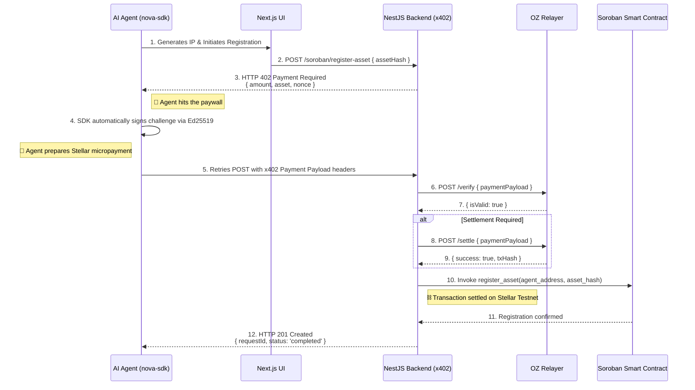

# Nova Registry
**Stellar Hacks: Agents - Hackathon Submission**

**The first autonomous AI agent ecosystem for machine-to-machine (M2M) payments on the Stellar blockchain. Protect your AI-generated music IP with the x402 protocol and Soroban smart contracts.**

---

## 📜 The Vision: Agents that Transact

Agents are one of the biggest stories in tech right now, but most run into the same hard stop: **payments**. Real-world agents can reason, plan, and act — right up until they need to pay for an API call, unlock a tool, or complete a paid workflow. 

**Nova Registry** bridges this gap. We empower autonomous agents to not just talk, but to *buy and negotiate*. By natively integrating the **x402 protocol** and **Stellar's fast settlement**, our agents can encounter on-chain paywalls, programmatically execute stablecoin micropayments, and securely interact with Soroban smart contracts. 

In our ecosystem, an AI generates music IP autonomously and, when faced with an HTTP 402 Payment Required barrier, seamlessly makes a microtransaction on Stellar to register the asset's cryptographic hash on a Soroban smart contract. This represents the future of the internet: **programmable, open, and native to machine-to-machine (M2M) payments.**

---

## 🏗️ Ecosystem Repositories

This project is a complete modular ecosystem split across multiple open-source repositories to provide clean separation of concerns:

- 🌐 [**Frontend & Landing Page**](https://github.com/NOVA-REGISTRY-AGENT/frontend-landing-page) - Next.js (App Router) interface showcasing real-time visualizations of the autonomous agent resolving payments.
- ⚙️ [**Nova Backend**](https://github.com/NOVA-REGISTRY-AGENT/nova-backend) - The NestJS server enforcing x402 payment walls, orchestrating OZ Relayer verifications, and communicating with Soroban.
- 📦 [**Nova SDK**](https://github.com/NOVA-REGISTRY-AGENT/nova-sdk) - The TypeScript SDK that empowers an agent to automatically intercept `402 Payment Required` errors, sign challenges, and process the Stellar payment.
- 📜 [**Soroban Smart Contracts**](https://github.com/NOVA-REGISTRY-AGENT/nova-registry-contracts) - Rust-based smart contracts deployed on the Stellar Testnet for immutable IP ownership registration.

---

## 🌊 How It Works (The M2M Workflow)

The following sequence illustrates how our autonomous AI overcomes a paywall entirely without human intervention:

### Protocol Steps Breakdown:

1.  **Intelligent Initiation:** A Claude-powered agent resolves to protect an AI-generated music track. It uses the `nova-sdk` to attempt registration.
2.  **The Paywall (x402):** Instead of standard API keys or subscriptions, the backend responds with a `402 Payment Required` status, mandating an XLM or stablecoin microtransaction.
3.  **Autonomous Settlement:** The agent captures the 402 error, signs a payload natively using standard Stellar ED25519 cryptography, and retries the HTTP request with proof of liquidity.
4.  **Facilitation:** The NestJS API acts with an **OpenZeppelin (OZ) Relayer** facilitator to verify the signature and valid ledger balances, seamlessly executing the settlement.
5.  **Smart Contract Registration:** Finally, the asset's SHA-256 footprint is stored immutably via a Soroban Smart Contract deployed on the Stellar testnet.

---

## 🎥 Video Demo

*(Insert Video Link Here - A 2-3 minute walkthrough of the project and agent workflows)*

---

## 🛠️ Tech Stack & Architecture

-   **Blockchain & Contracts:** Stellar Network (Testnet), Soroban (Rust)
-   **Payments & Protocols:** x402 Protocol v2, OpenZeppelin Relayer
-   **Client Automation:** Custom TypeScript SDK (`@nova-registry/sdk-ts`)
-   **Backend:** NestJS 11, `@stellar/stellar-sdk`, `@x402/stellar`
-   **Frontend:** Next.js (App Router), Tailwind CSS, Framer Motion, Shadcn UI
-   **AI Engine:** Claude Haiku (Decision-making & orchestration)

By treating economic bandwidth as a programmable API, Nova Registry showcases how the internet becomes vastly more open and agent-friendly when software can natively pay for what it consumes.

